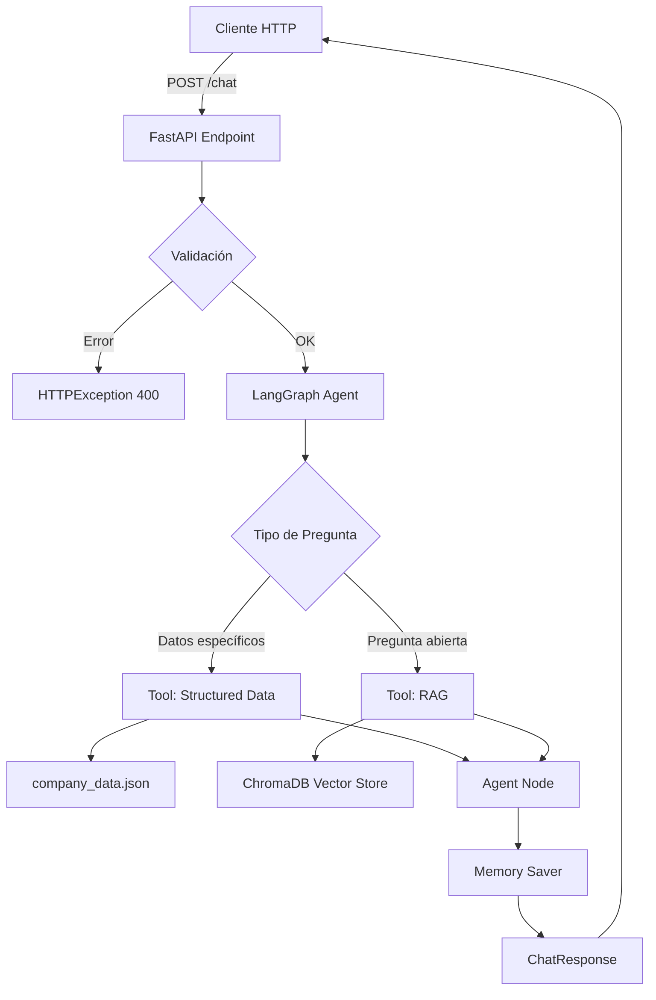

# 🚀 Colombina RAG Chatbot API

API REST para el agente conversacional de Colombina con capacidades RAG (Retrieval-Augmented Generation) y memoria persistente.

## 📋 Características

- **🤖 Agente Conversacional Inteligente**: Utiliza LangGraph con múltiples herramientas especializadas
- **🔍 Sistema RAG**: Búsqueda semántica en base de conocimiento vectorial
- **💭 Memoria Persistente**: Mantiene el contexto entre mensajes de la misma sesión
- **🛠️ Sistema de Fallback**: Múltiples estrategias para encontrar respuestas
- **📊 API REST Documentada**: Documentación automática con OpenAPI/Swagger
- **🔒 Validación de Datos**: Modelos Pydantic para requests y responses

## 🔧 Instalación

### 1. Instalar dependencias de la API

```bash
# Desde la raíz del proyecto
pip install -r api/requirements.txt
```

O agregar al `requirements.txt` principal:
```
fastapi>=0.104.0
uvicorn[standard]>=0.24.0
pydantic>=2.0.0
```

### 2. Configurar variables de entorno

Asegúrate de tener el archivo `.env` en la raíz con:
```bash
OPENAI_API_KEY=tu_api_key_aqui
```

### 3. Verificar que la base vectorial esté creada

```bash
# Si no existe, crear la base vectorial
python RAG/vector_db/load_data.py
```

## 🏃‍♂️ Uso

### Iniciar el servidor

```bash
# Opción 1: Ejecutar directamente
python api/main.py

# Opción 2: Usar uvicorn
uvicorn api.main:app --reload --host 0.0.0.0 --port 8000
```

El servidor estará disponible en: `http://localhost:8000`

### Documentación Interactiva

- **Swagger UI**: http://localhost:8000/docs
- **ReDoc**: http://localhost:8000/redoc

## 📡 Endpoints

### 1. **GET /** - Información de la API

```bash
curl http://localhost:8000/
```

**Respuesta:**
```json
{
  "name": "Colombina RAG Chatbot API",
  "version": "2.0.0",
  "description": "API para interactuar con el agente conversacional de Colombina",
  "docs": "/docs",
  "health": "/health"
}
```

### 2. **GET /health** - Verificación de salud

```bash
curl http://localhost:8000/health
```

**Respuesta:**
```json
{
  "status": "healthy",
  "version": "2.0.0"
}
```

### 3. **POST /chat** - Enviar mensaje al chatbot

**Parámetros:**
- `message` (str): Mensaje del usuario (1-2000 caracteres)
- `session_id` (str): ID único de sesión para mantener contexto

**Ejemplo con curl:**
```bash
curl -X POST http://localhost:8000/chat \
  -H "Content-Type: application/json" \
  -d '{
    "message": "¿Cuál es el NIT de Colombina?",
    "session_id": "user-123-session-456"
  }'
```

**Respuesta:**
```json
{
  "response": "El NIT de la empresa Colombina es 890.301.244-4.",
  "session_id": "user-123-session-456",
  "success": true
}
```

**Ejemplo con Python:**
```python
import requests

response = requests.post(
    "http://localhost:8000/chat",
    json={
        "message": "¿Cuál es la misión de Colombina?",
        "session_id": "user-123-session-abc"
    }
)

print(response.json())
```

**Ejemplo con JavaScript:**
```javascript
fetch('http://localhost:8000/chat', {
  method: 'POST',
  headers: {
    'Content-Type': 'application/json',
  },
  body: JSON.stringify({
    message: '¿Qué productos fabrica Colombina?',
    session_id: 'user-123-session-xyz'
  })
})
.then(response => response.json())
.then(data => console.log(data));
```

### 4. **DELETE /session/{session_id}** - Limpiar sesión

```bash
curl -X DELETE http://localhost:8000/session/user-123-session-456
```

**Respuesta:**
```json
{
  "message": "Sesión user-123-session-456 limpiada exitosamente",
  "session_id": "user-123-session-456",
  "success": true
}
```

## 💬 Ejemplos de Conversación

### Conversación con memoria:

```bash
# Mensaje 1
curl -X POST http://localhost:8000/chat \
  -H "Content-Type: application/json" \
  -d '{
    "message": "¿Quién fundó Colombina?",
    "session_id": "session-001"
  }'
# Respuesta: "Hernando Caicedo fundó Colombina en 1927..."

# Mensaje 2 (mismo session_id = mantiene contexto)
curl -X POST http://localhost:8000/chat \
  -H "Content-Type: application/json" \
  -d '{
    "message": "¿Y en qué año?",
    "session_id": "session-001"
  }'
# Respuesta: "Colombina fue fundada en 1927..."
```

### Tipos de preguntas soportadas:

#### Datos específicos (usa herramienta de datos estructurados):
```json
{
  "message": "¿Cuál es el NIT de la empresa?",
  "session_id": "session-002"
}
```

#### Preguntas abiertas (usa RAG):
```json
{
  "message": "Cuéntame sobre la historia de Colombina",
  "session_id": "session-003"
}
```

#### Preguntas con contexto:
```json
// Primera pregunta
{
  "message": "¿Qué productos fabrica Colombina?",
  "session_id": "session-004"
}

// Segunda pregunta (usa memoria)
{
  "message": "¿Cuál es el más famoso?",
  "session_id": "session-004"
}
```

## 🔒 Códigos de Estado HTTP

| Código | Descripción |
|--------|-------------|
| 200 | Respuesta exitosa |
| 400 | Solicitud inválida (parámetros faltantes o incorrectos) |
| 500 | Error interno del servidor |
| 503 | Servicio no disponible |

## 📊 Modelos de Datos

### ChatRequest
```json
{
  "message": "string (1-2000 caracteres)",
  "session_id": "string (1-200 caracteres)"
}
```

### ChatResponse
```json
{
  "response": "string",
  "session_id": "string",
  "success": true
}
```

### ErrorResponse
```json
{
  "detail": "string",
  "session_id": "string | null",
  "success": false
}
```

## 🛠️ Arquitectura



## 🧪 Testing

### Test manual con curl:

```bash
# Test 1: Health check
curl http://localhost:8000/health

# Test 2: Chat básico
curl -X POST http://localhost:8000/chat \
  -H "Content-Type: application/json" \
  -d '{"message": "Hola", "session_id": "test-001"}'

# Test 3: Pregunta con datos estructurados
curl -X POST http://localhost:8000/chat \
  -H "Content-Type: application/json" \
  -d '{"message": "¿Cuál es el NIT?", "session_id": "test-002"}'

# Test 4: Pregunta con RAG
curl -X POST http://localhost:8000/chat \
  -H "Content-Type: application/json" \
  -d '{"message": "¿Cuál es la misión de Colombina?", "session_id": "test-003"}'

# Test 5: Limpiar sesión
curl -X DELETE http://localhost:8000/session/test-001
```

### Test con Python:

```python
import requests

BASE_URL = "http://localhost:8000"

# Test conversación con memoria
session_id = "python-test-001"

# Pregunta 1
response1 = requests.post(
    f"{BASE_URL}/chat",
    json={
        "message": "¿Quién fundó Colombina?",
        "session_id": session_id
    }
)
print("Respuesta 1:", response1.json())

# Pregunta 2 (con contexto)
response2 = requests.post(
    f"{BASE_URL}/chat",
    json={
        "message": "¿En qué año?",
        "session_id": session_id
    }
)
print("Respuesta 2:", response2.json())

# Limpiar sesión
delete_response = requests.delete(f"{BASE_URL}/session/{session_id}")
print("Sesión limpiada:", delete_response.json())
```

## 🐛 Troubleshooting

### Error: "Module 'fastapi' not found"
```bash
pip install -r api/requirements.txt
```

### Error: "OPENAI_API_KEY no configurada"
```bash
# Crear archivo .env en la raíz
echo "OPENAI_API_KEY=tu_key_aqui" > .env
```

### Error: "No se encuentra la base vectorial"
```bash
# Crear la base de datos vectorial
python RAG/vector_db/load_data.py
```

### Puerto 8000 en uso
```bash
# Usar otro puerto
uvicorn api.main:app --reload --port 8001
```

## 📝 Logs

Los logs se guardan en `logging_util/logs/` y se muestran en consola:

```
2025-11-16 10:30:15 - INFO - 💬 Nuevo mensaje - Session: user-123
2025-11-16 10:30:15 - INFO - 👤 Mensaje del usuario: ¿Cuál es el NIT?
2025-11-16 10:30:15 - INFO - 🤖 Invocando agente conversacional...
2025-11-16 10:30:16 - INFO - ✅ Respuesta generada exitosamente
```

## 🔐 Seguridad

- ✅ Validación de entrada con Pydantic
- ✅ Límites de tamaño en mensajes (1-2000 caracteres)
- ✅ Manejo de errores robusto
- ✅ API Key en variables de entorno
- ⚠️ En producción: Configurar CORS adecuadamente
- ⚠️ En producción: Agregar autenticación (JWT, API Keys)
- ⚠️ En producción: Rate limiting

## 📦 Deployment

### Docker (ejemplo):

```dockerfile
FROM python:3.13-slim

WORKDIR /app

COPY requirements.txt api/requirements.txt ./
RUN pip install -r requirements.txt

COPY . .

CMD ["uvicorn", "api.main:app", "--host", "0.0.0.0", "--port", "8000"]
```

### Producción:

```bash
# Usar Gunicorn con workers
gunicorn api.main:app -w 4 -k uvicorn.workers.UvicornWorker --bind 0.0.0.0:8000
```

## 🤝 Integración

Esta API puede integrarse con:
- Aplicaciones web frontend (React, Vue, Angular)
- Aplicaciones móviles (iOS, Android)
- Chatbots de terceros (Telegram, WhatsApp, Slack)
- Sistemas empresariales internos
- Interfaces de voz (Alexa, Google Assistant)

## 📄 Licencia

Apache 2.0 - Ver archivo LICENSE en la raíz del proyecto

---

**API desarrollada por el equipo de Colombina Chatbot** 🍭🤖
